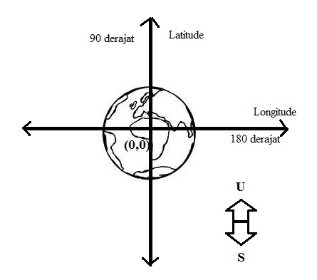

Nama	: Eva Nur Fauziyah
NPM	: 1144084
Kelas	: D4 TI 3A

===============================================================================

RESUME PENGANTAR SISTEM INFORMASI GEOGRAFIS

1. Latar Belakang
Seperti yanng kita ketahui, bentuk dari bumi itu adalah bulat. Untuk memperjelas bentuk permukaan bumi maka munculah sebuah ilmu tentang sistem informasi geografis. Pada tahap awal, yang akan dibahas yaitu pengertian SIG, koordinat dan aplikasi yang dipakai.

A. Pengertian
Sistem : proses yang melibatkan seluruh aspek untuk mencapai satu tujuan.
Informasi : hasil pengolahan data
Geografis : terdiri dari dua kata yaitu geo dan grafis. geo adalah bumi dan grafis adalah bentuk bumi.
Jadi Sistem Informasi Geografis adalah sistem informasi khusus yang mengelola dimana hal tersebut memiliki informasi spasial (ruang).

B. KOORDINAT

Dalam google map seperti yang kita ketahui, disana terdapat Long dan Lat. Dimana Long tersebut adalah Longitude dan Lat itu adalah Latitude.
Garis Longitude adalah garis vertikal yang mengatur sudut suatu titik dengan garis khatulistiwa.
Sedangkan garis latitude/prime meridian adalah garis horizontal yang mengukur suatu titik dengan titik nol di bumi. 
Titik 0 bumi itu terdapat di kota Greenwich. Kenapa di kota Greenwich dan dijadikan patukan waktu dunia yang sering kita sebut dengan GMT (Greenwich Mean Time)?
Karena Inggris adalah negara yang kuat dan yang paling sering menjajah negara yang lainnya, selain itu Greenwich itu dijadikan untuk keperluan navigasi pelayaran kerajaan Inggris,
jadi tidak ada satupun negara yang berani protes tentang Greenwich dijadikan sebagai titik 0 bumi.
Satuan dari koordinat itu adalah derajat karena derajat adalah satuan untuk mengukur benda yang bulat.
Nilai maksimal dari garis latitude adalah 90 derajat. Sedangkan nilai maksimal dari garis longitude adalah 180 derajat.

C. APLIKASI BELAJAR SIG
Untuk mempelajari dan memahami lebih lanjut tentang GIS, bisa menggunakan bantuan aplikasi sebagai berikut:
1. QGIS
2. Map Server

Kesimpulan
Jadi, Sistem Informasi Geografis ini adalah ilmu untuk mempelejari bentuk ruang bumi yang diukur melalui kordinat (long, lat). Untuk mempelajari lebih lanjut tentang SIG, bisa menggunakan aplikasi QGIS dan Map Server.
