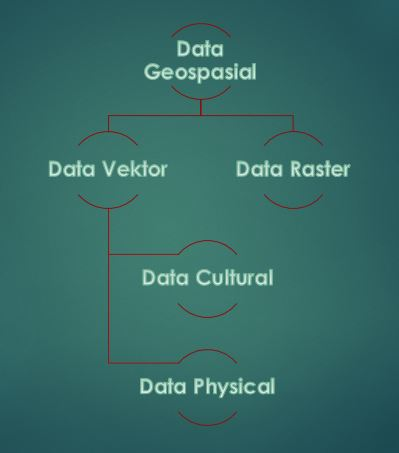

<h2 align="center">DATA GEOSPASIAL-Pertemuan ke-2 GIS </h2>

 

 

<strong>PEMBUKAAN</strong> 
Latar Belakang 
Pada kesempatan ini, kita akan membahas tentang pengertian dan pembagian dari geospasial dan aplikasi yang dipakai dalam Data Geospasial 

<strong>ISI</strong> 
Geospasial atau ruang kebumian adalah aspek keruangan yang menunjukkan lokasi, letak, dan posisi suatu objek atau kejadian yang berada di bawah, pada, atau di atas permukaan bumi yang dinyatakan dalam sistem koordinat tertentu. 

Data Geospasial ini dibagi menjadi dua, yaitu: 
<b>1. Data Vektor </b>
Data vektor berisi data titik koordinat. Seperti yang kita tau dalam geometri, bahwa:
 

 

 
Jadi, data vektor ini isinya titik, atau bisa juga garis(kumpulan titik), atau bisa juga poligon(kumpulan garis). 
Format dari data vektor adalah .shp (shape file) yang diluncurkan oleh ESRI. 
Contoh vektor adalah misalnya bentuk pulau jawa. 
Data vektor ini terbagi menjadi 2, yaitu: 
<i>a. Data Cultural</i> 
Data yang dipengaruhi oleh peradaban. Contohnya: 
- bangunan 
- batas wilayah (dulu ketika kerajaan majapahit, ibu kotanya adalah Tumasik, tetapi sekarang sudah berubah, Tumasik ini diganti dengan Surabaya) 
- batas kota 
<i>b. Data Physical</i> 
Data Physical ini ada secara nyata terlihat di bumi yang tidak berubah kecuali kiamat. Contohnya: 
- Pulau 
- Sungai 
- Gunung 
- Laut 
- Benua 

<b>2. Data Raster</b> 
Data raster ini berisi data gambar. Formatnya yaitu .JPG-2000. 
Contoh dari data raster misalnya pewarnaan pada peta. Seperti halnya pada peta atlas, terdapat berbagai warna pada peta, seperti Wana hijau, kuning dll. 
 
Untuk mempelajari lebih lanjut tentang data geospasial, kita bisa menggunakan aplikasi QGIS dengan mendownload Natural Earth. Disana terdapat 3 data yang bisa didownload dengan format .shp dan .dbf yang nantinya bisa dibuka di aplikasi QGIS. 
 
Selesai sudah penjelasan tentang data geospasial yang berisi tentang pengertian dan pembagian dari geospasial dan aplikasi yang dipakai dalam Data Geospasial .  
 
<strong>KESIMPULAN</strong> 
Jadi, data geospasial adalah data tentang bentuk ruang bumi yang menunjukan tempat, lokasi atau posisi dalam suatu objek yang dinyatakan pada koordinat tertentu. 
 
<strong>SARAN</strong> 
Sebaiknya jika ingin tau lebih banyak tentang mempelajari GIS, alangkah terlebih dahulu mempelajari geospasial. 
 
Referensi : http://pinterdw.blogspot.co.id/2012/03/pengertian-geospasial.html

