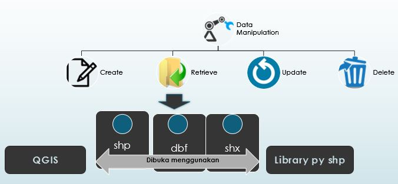

<h2 align="center">MANIPULASI DATA GEOSPASIAL - Pertemuan ke-3 GIS </h2>

 

 

 
<strong>PEMBUKAAN</strong> 
<b>Latar Belakang </b> 
Pada pertemuan ke-3 Sistem Informasi Geografis ini, saya akan membahas tentang bagaimana memanipulasi data geospasial seperti hal nya pada framework lain pada data vektor yang berformat shp. Untuk memanipulasi data geospasial yaitu dengan CRUD. Mari kita uraikan bagaimana caranya memanipulasi data khususnya bagian retrieve, file yang dibutuhkannya, aplikasi yang dipakai serta tutorial penggunaan library py shp. 
 
<strong>ISI</strong> 
Cara memanipulasi data geospasial dapat dilakukan dengan CRUD. Apa itu CRUD? CRUD berasal dari singkatan dari Create Retrieve Update Delete , yang sering digunakan pada software atau aplikasi pengolahan data yang kebanyakan menggunakan fungsi CRUD didalamnya termasuk dalam pengelolaan data geospasial . CRUD ini digunakan untuk menambahkan data, menghapus data, serta mengubah data dan menampilkan data. 

Dikhususkan pada penjelasan <b>Retrieve</b>. Retrieve adalah bagaian dari manipulasi data yang digunakan untuk melihat isi data pada geospasial berupa data vektor yaitu yang berbentuk shape file yang diluncurkan oleh ESRI dengan extensil .shp. 

File yang dibutuhkan untuk melakukan manipulasi data yaitu: 
1. shp -> berupa koordinat/titik. 
2. dbf -> berupa tabel/database. 
3. shx -> berisi index data 

Dari ketiga file tersebut, ketiganya dapat dibuka menggunakan aplikasi: 
<b>a. QGIS</b>  
&nsbp;&nsbp;&nsbp;QGIS adalah aplikasi untuk mempelajari sistem informasi geografis (include data geospasial). Cara menggunakannnya yaitu: 
- buka aplikasi QGIS 
- klik kanan view data (buka filenya kemudian drag & drop). Pertama masukan dulu file .shp nya kemudian disusul dengan file .dbf yang terdapat pada natural earth. 
<b>b. Library py shp</b> 
&nsbp;&nsbp;&nsbp;Library py shp merupakan library dari bahasa pemrograman python. Caranya yaitu: 
- install python. Dalam python terdapat dua bentuk. yaitu console (dipakai untuk debug/trial/coba-coba) dan script(di dalam satu file terdapat script python) 
- install pip 
- install py shp 
- mulai pengkodean 
Untuk pengguna linux, untuk melakukan library shp tidak usah menginstall yang di atas, tetapi untuk pengguna windows disarankan untuk menginstall jika ingin memakai libarary py shp. 

Berikut adalah contoh pengkodean atau script untuk menghitung jumlah record pada sebuah file yang berformat shp: 
- masuk ke lokasi python terlebih dahulu 
- ketikan python 
- ketikan import shape file 
- ketikan a=shapefile.Reader ('shp/bts_negara.shp') 
- ketikan b=a.shapes() 
- ketikan print len (b) 
 
Untuk lebih jelasnya bisa kunjungi tutorialnya pada akun youtube saya https://youtu.be/WKeO5SJmgR8 

 
<strong>PENUTUP</strong> 
<strong>Kesimpulan</strong> 
Jadi untuk memanipulasi data dengan cara CRUD (create, retrieve, update, delete). Untuk melihat isi data (retrieve) bisa menggunakan aplikasi QGIS atau library py shp yang menggunakan bahasa python.  
 
<strong>Saran</strong> 
Tutorial di atas perlu dicoba atau dipraktekan guna untuk mempelajari lebih lanjut tentang memanipulasi data geospasial. 
 
Sekian terimakasih. 
 

Referensi: http://jagocoding.com/tutorial/684

