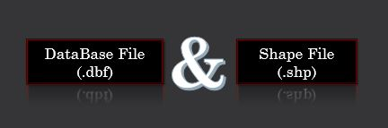
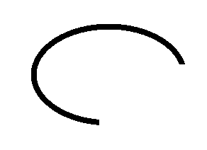
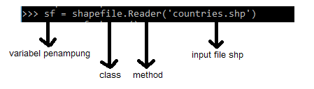
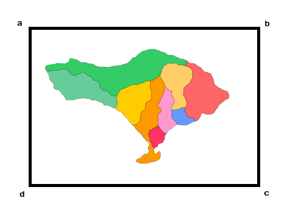
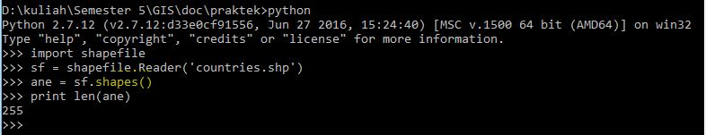
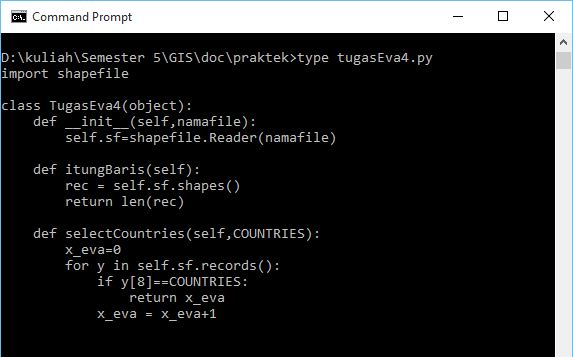
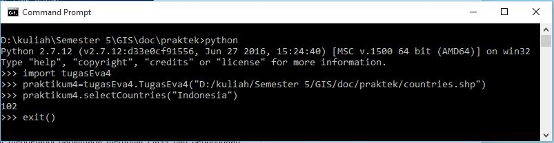

<h2 align="center">RETRIEVE DATA GEOSPASIAL - Pertemuan ke-4 GIS </h2>

 

 

 
<strong>PEMBUKAAN</strong> 
<b>Latar Belakang </b> 
Seperti yang telah dijelaskan pada pertemuan sebelumnya bahwa untuk memanipulasi data geospasial khususnya pada data vektor dilakukan dengan cara CRUD (create, reatrieve, update, delete). Untuk lebih jelasnya tentang pembahasan Retrieve data maka pertemuan kali ini akan membahas tentang: 
a.	Retrieve Data Vektor 
b.	Operasi pengambilan data menggunakan pemrograman phyton pada library pyshp 
c.	Tugas praktikum membuat class geospasial editor dengan menggunakan method select where negara dengan menggunakan python. 
 
<strong>ISI</strong> 
<b>A.	Retrieve Data Vektor</b> 
Untuk meretrieve data atau menampilkan data geospasial (data vektor) yang berformat shape file atau .shp menggunakan library phyton yang bernama pyshp. 
Seperti yang kita ketahui bahwa shape file adalah standar file vektor geospasial yang dikeluarkan oleh perusahaan ESRI. 
Shape file memiliki 2 format. 
<i><b>1.	.shp</b></i> 
Yang berisikan data geometri. Data geometri adalah data kordinat yang memiliki bangun data atau ruang. 
Diantaranya: 
a.	<i>Data point/ titik</i>. Data point memiliki nomor standar [1]. 
b.	<i>Line/Garis/Polyline</i>. Polyline memiliki nomor standar [3]. Seperti yang digambarkan di bawah ini bahwa polyline tidak akan kembali ke titik awal seperti jalan, sungai dll. 

 

 
 c.	<i>Polygon</i>. Memiliki nomor standar [5]. Adapun polygon akan kembali ke titik awal seperti gambar berikut. Contohnya adalah batas wilayah, negara dll. 
 

 

 
Dari ketiga hal tersebut maka ESRI menyebutkan bahwa point, polyline dan polygon disebut shape type yang memiliki nomor standar [1],[3], dan [5]. 
 
<i><b>2.	.dbf</b></i> 
Data yang berisikan tabel basis data. 
 
 
<b>B.	Operasi Pengambilan Data</b> 
Operasi pengambilan data ini menggunakan library pyshp class shape file. Cara membukanya yaitu: 
a.	Buka cmd dan masuk ke dalam python 
b.	Baca shapefile 

 
  
Kemudian, pada: 
<b>1.	.shp</b> 
File shp ini berisikan bbox, parts, points dan shape type. 
Keterangan: 
•	<i>Bbox (Boarding Box)</i> merupakan batas view peta. Contohnya: koordinat a,b,c,d disebut dengan bbox. (ex in python: Nomor1.bbox) 

 
•	<i>Parts</i> = apakah record ini bagian record yang lainnya atau pecahan lainnya. (ex in python: Nomor1.parts) 
•	<i>Points</i> = yang membentuk titik-titik di peta/koordinat pembentuk peta. . (ex in python: Nomor1.points) 
•	<i>Shape type</i> = jenis geometri dari points. . (ex in python: Nomor1.shapeType) 
 
Adapun Operasi pada shp mengunakan method: 
-	Shapes() 
Contoh dalam menampilkan jumlah record : 

  
-	Shape (n), dimana n adalah nomor record. 
 
<b>2	.dbf</b> 
Pada file dbf pengaksesannya menggunakan [ ]. 
Adapun operasi pada dbf menggunakan method: 
-	records() 
-	record(n), dimana n merupakan nomor sequence record. 
 
 
<b>C.	Tugas Praktikum</b> 
1.	buatlah class geospasial editor 

 
2.	Buatlah method select, where negara dengan record Indonesia 

 

 

<strong>PENUTUP</strong> 
<b>Kesimpulan</b> 
Jadi untuk menampilkan atau meretrieve data vektor bisa menggunakna library python yang bernama pyshp. Di dalam itu bisa kita gunakan class dan method untuk mengambil data yang berformat shp. 

<b>Saran</b> 
Lebih diperbanyak praktek karena berlatih secara langsung dapat memudahkan pelajar untuk memahami hal yang dipelajari dibandingkan dengan membaca materi beribu ribu halaman. 

