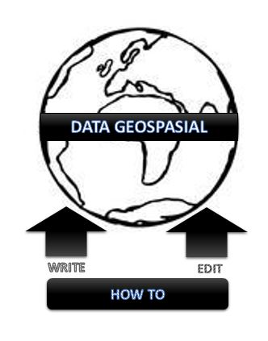
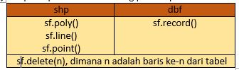

<h2 align="center">MEMBUAT DAN MENGEDIT DATA GEOSPASIAL </h2>

 

 

  
<strong>PEMBUKAAN</strong> 
<b>Latar Belakang Masalah</b> 
Untuk melanjutkan dari pembahasan sebelumnya tentang manipulasi data geospasial, kali ini kita akan membahas tentang bagaimana cara membuat dan mengedit data geospasial menggunakan library pyshp. 
 
<strong>ISI</strong> 
<b>A.	Cara Membuat Data Geospasial</b> 
Pembuatan data geospasial ini menggunakan libarary pyshp. Untuk membuat data geospasial diperlukan file namafile.shp beserta namafile.dbf. 
Adapun langkahnya adalah sebagai berikut: 
a.	Import shapefile 
b.	Instansiasi writer method 
    sf = shapefile.Writer(param) 
    Dimana param adalah pilih shapetype: 
    1.	shapeType = 1 
    2.	shapeType = 3 
    3.	shapeType = 5 
c.	Sama seperti read, kita lakukan metode dbf dan shp. 
 
<b>-	Shapefile (shp)</b> 
Untuk menambahkan record tergantung dengan type ESRInya. 
1. sf.point (x,y) 
3. sf.line = (parts: [[x,y],[z,w],...]) 
6. sf.poly = (parts: [[x,y],[z,w],...]) 

 
<b>-	Databasefile (dbf)</b> 
Tahapannya adalah sebagi berikut: 
a.	Membuat atribut dahulu kemudian menambahkan record.  
    Contoh: 
    sf.field (‘Nama Filed’,’C’,’40’) 
    Dimana C adalah Character, dan 40 adalah length. Dalam arti nama atribut, nama field dengan panjang 40 karakter. 
b.	Tambahkan record dibawah ini 
    sf.record(‘Bandung’) 
    sf.record(‘Bandung’,’Sarijadi’) 
c.	Setelah selesai maka simpan, dengan perintah: 
sf.save(‘namafile.shp’) 
  
<b>B.	EDITING DATA GEOSPASIAL</b> 
Adapun dalam editing data geospasial hampir sama dengan langkah-langkah membuat data geospasial, yang membedakan adalah: 
<i>sf = shapefile.Writer(param)</i> 
diganti dengan 
<i>sf = shapefile.Editor(param)</i> 
dimana param adalah nama letak file. 
 
Adapun operasi dalam editing pada shp dan dbf sama saja. 

 

  
Dan jika sudah selesai, simpan dengan perintah: 
Sf.save(‘namafile’) 
 
<strong>PENUTUP</strong> 
<b>Kesimpulan</b> 
Jadi, untuk membuat dan mengedit data geospasial langkah-langkahnya hampir sama. Yang membedakan adalah method yang digunakan. Metgod yang digunakan untuk membuat data geospasial adalah WRITE sedangankan untuk mengedit adalah EDITOR. 
 
<b>Saran</b>
Adapun sarannya yaitu untuk memahami lebih lanjut dan lebih rinci tentang cara membuat dan mengedit data geospasial, bisa kita praktekan secara langsung menggunakan bahasa pemrograman python. Hal tesebut harus dicoba guna untuk mengetes langkah-langkah di atas berhasil atau tidak.

