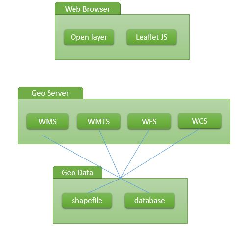

<h2 align="center">INSTALASI MAP PROXY DAN MAP SERVER PADA UBUNTU </h2>

 

 

  
<strong>PEMBUKAAN</strong> 
<b>Latar Belakang Masalah</b> 
Pada zaman sekarang yang semakin canggil ini berbagai macam cara bisa dilakukan dalam pemanfaatan geografis pada sistem digital seperti menyediakan map atau peta yang dibuat secara sistem sesuai dengan keinginan si pembuat peta. Salah satunya yaitu google maps. Adapun pada pembahasan kali ini akan menjelaskan bagaimna cara membuat maps secara custom. 
 
<strong>ISI</strong> 
<b>1. Pengertian Map Server</b> 
Secara singkat map server adalah penyedia layanan (web service peta). Dalam arti Map Server adalah sebuah lingkungan pengembangan open source untuk membangun aplikasi internet spasial diaktifkan. Hal ini dapat dijalankan sebagai program CGI atau melalui Mapscript yang mendukung beberapa bahasa pemrograman (menggunakan SWIG). MapServer dikembangkan oleh University of Minnesota - jadi, sering dan lebih khusus disebut sebagai "UMN MapServer", untuk membedakannya dari komersial "peta server". MapServer awalnya dikembangkan dengan dukungan dari NASA, yang membutuhkan cara untuk membuat citra satelit yang tersedia untuk umum. 

  
<b>2. Pengertian Map Proxy</b> 
Map proxy adalah aplikasi penampung data sementara dari penyedia layanan web (web service) peta, agar pengambilan data yang berulang-ulang lebih cepat (tanpa meminta kembali ke map server). 
 
<b>3. Web Service Peta</b> 
Web service peta terdiri dari 2 bagian, yaitu: 
a. <i>Lossly</i> (ada data yang dibuang). Seperti WMS (Web Map Service) dan WMTS (Web Map Tile Service) 
b. <i>Lossless</i> seperti WFS (web Feature Service) dan WCS (Web Corrage Service) 
Keseluruhan format ini distandarkan oleh organisasi OGC. 
 
<b>4. Cara Instalasi Map Server dan Map Proxy</b> 
Untuk menginstalasi map server direkomendasikan menggunakan linux atau virtualbox. 
LAngkahnya:  
a. Buka terminal (ubuntu) 
b. Ketikan perintah sudo apt-get install cgi-mapserver 
c. Untuk mengetahui struktur direktori Map Server, gunakan perintah : dpkg -L cgi-mapserver 
d. Karena saya mengeksekusinya menggunakan python, install python juga dengan perintah : sudo apt-get install python-pip python-dev 
e. Kemudian install uwsgi, dengan perintah : sudo pip install uwsgi 
f. Kemudian install Map Proxy, dengan perintah : sudo pip install MapProxy  
g. Setelah diinstall maka unduh peta Indonesia dan konfigurasi map proxy serta map file dari map server di halaman download. 
 
<strong>PENUTUP</strong> 
<b>Kesimpulan</b> 
Jadi, untuk membuat map secara custom, kita harus terlebih dahulu menginstall map server dan map proxy pada ubuntu (disarankan). 
 
<b>Saran</b>
Praktikum tentang hal ini harus bisa lebih dipahami dimengerti, tidak hanya dibuat saja, tetapi harus tahu fungsi dari setiap perintah yang dieksekusi.

