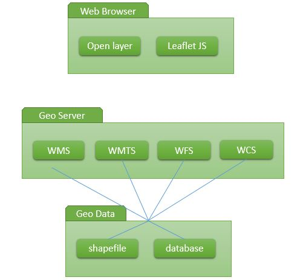

<h2 align="center">INSTALASI MAP PROXY DAN MAP SERVER PADA UBUNTU </h2>

 

 

  
<strong>PEMBUKAAN</strong> 
<b>Latar Belakang Masalah</b> 
Pada zaman sekarang yang semakin canggil ini berbagai macam cara bisa dilakukan dalam pemanfaatan geografis pada sistem digital seperti menyediakan map atau peta yang dibuat secara sistem sesuai dengan keinginan si pembuat peta. Salah satunya yaitu google maps. Adapun pada pembahasan kali ini akan menjelaskan bagaimna cara menjalankan map proxy dan map server yang telah diinstal sebelumnya di materi sebelumnya (pertemuan ke-6) 
 
<strong>ISI</strong> 
Adapun cara menjalankannya yaitu sebagai berikut: 
a. Untuk meload data geospasial, kita perlu menyiapkannya dulu agar akan ditampilkan nantinya di Map Proxy. Kalian bisa mendownload data geospasial di situs ini, http://www.halaman.download/ kemudian pilih "Producer" dan klik "Indonesia Mapproxy". 
b. Jika sudah download ekstrak file tersebut (Penting!! Ketahui dimana anda mengekstrak file tersebut, karena path-nya akan digunakan untuk mengedit file yang ada di direktori yang telah di ekstrak tersebut. 
Disini saya simpan di direktori Downloads (Huruf kecil dan besar di perhatikan.) 
c. Pada file indomap -> mapproxy, akan terdapat 3 file. Buka file agm.yaml 
d. Pada file agm.yaml, edit beberapa baris ini sesuai dengan direktori tempat anda menyimpan file tersebut : 
- pada baris 
binary: /usr/libexec/mapserver 
ubah menjadi 
binary: /usr/lib/cgi-bin/mapserv 
- pada baris 
map: var/mapdata/mapfile/indo.map 
ubah menjadi 
map: /home/eva/Downloads/indomap/mapfile/indo.map 
- Kemudian direktori baru dengan nama tmp pada direktori indomap 
ubah baris 
working_dir: /var/mapdata/tmp 
menjadi 
/home/eva/Downloads/indomap/tmp 
Kemudian Save  
e. Kemudian pada direktori mapproxy(di terminal/cmd), gunakan perintah : 
vi mapproxy.ini 
edit baris 
chdir = /var/mymapproxy/ 
menjadi 
chdir = /home/ali/Downloads/indomap/mapproxy 
Kemudian Save 
f. edit file config.py pada direktori mapproxy 
ubah 
application = make_wsgi_app(r'/var/mymapproxy/agm.yaml') 
menjadi 
application = make_wsgi_app(r'/home/ali/Downloads/indomap/mapproxy/agm.yaml')  
g. Untuk menjalankan programnya gunakan perintah 
uwsgi mapproxy.ini 
h. Untuk mengecek apakah mapproxy sudah terinsall atau belum, buka browser kemudian ketik localhost:8080 
i.  Klik demo atau ketik localhost:8080/demo 
j. Pada bagian WMTS klik di bawah Image Format yaitu png 
k. Tunggu beberapa saat karna datanya sedang di load. 
l. Map Peta akan muncul 
 
<strong>PENUTUP</strong> 
<b>Kesimpulan</b> 
JSetelah dipraktekannya tutorial di atas, maka kita dapat mengetahui bagaimana cara menjalankan map server dan map proxy di dalam sistem operasi ubuntu. 
 
<b>Saran</b>
Praktikum tentang hal ini harus bisa lebih dipahami dimengerti, tidak hanya dibuat saja, tetapi harus tahu fungsi dari setiap perintah yang dieksekusi.

